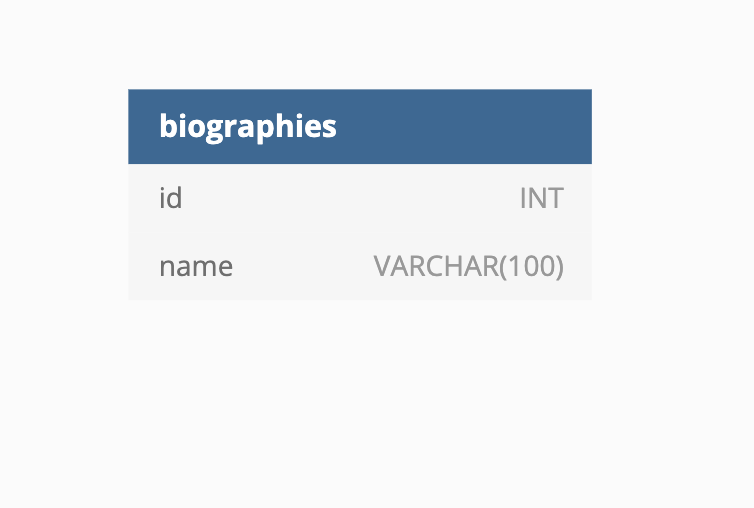

# 🏗️ Add Table to Database

Work with a partner to implement the following user story:

* As a developer, I want to delete a table from an existing database and replace it with a new table.

## Acceptance Criteria

* It's done when a new table `biographies` has been created and includes two columns `id` and `name`.

* It's done when the `id` column has a data type of `INT` and the `name` column has a data type of `VARCHAR(100)`.

## Assets

The following image demonstrates the web application's appearance and functionality:

---

## 💡 Hints

How can you display a list of existing tables in a database?

## 🏆 Bonus

If you have completed this activity, work through the following challenge with your partner to further your knowledge:

* What is the difference between a table and a database?

Use [Google](https://www.google.com) or another search engine to research this.

---
© 2021 Trilogy Education Services, LLC, a 2U, Inc. brand. Confidential and Proprietary. All Rights Reserved.
