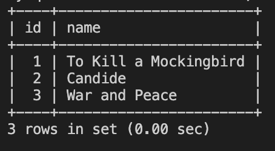

# 🐛 Data Not Updating in Database

Work with a partner to resolve the following issue(s):

* As a user, I want to update a single row of data in a table using a MySQL statement.

## Expected Behavior

When I execute a MySQL statement, I want only the data with an `id` of `2` to update to `Candide`.

## Actual Behavior

When I execute a MySQL statement to update the data, the data in every row displays the new value.

## Steps to Reproduce the Problem

1. Create a `books_db` database and select it for use.

2. Execute the `insert.sql` file in the command line to insert data.

3. Execute the `update.sql` file to update the table.

4. Enter the query `SELECT * FROM fiction` to view the contents of the table.

## Assets

The following image demonstrates the web application's appearance and functionality:

---

## 💡 Hints

Which clause do we use to filter and select specific rows to be updated?

## 🏆 Bonus

If you have completed this activity, work through the following challenge with your partner to further your knowledge:

* How do we distinguish SQL syntax from other text?

Use [Google](https://www.google.com) or another search engine to research this.

---
© 2021 Trilogy Education Services, LLC, a 2U, Inc. brand. Confidential and Proprietary. All Rights Reserved.
