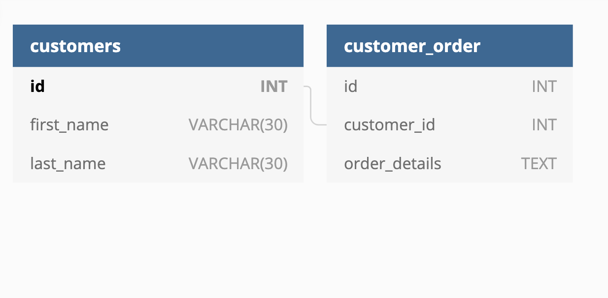

# 🏗️ Use Primary Key and Foreign Key to Define Relationship Between Tables

Work with a partner to implement the following user story:

* As a developer, I want to organize my data by linking a `customers` table with a related `customer_orders` table.

## Acceptance Criteria

* It's done when the `id` column in the `customers` table is defined as the primary key.

* It's done when the foreign key in the `customer_orders` table refers to the `customers` table primary key.

## Assets

The following image demonstrates the web application's appearance and functionality:

---

## 💡 Hints

What is the difference between primary and foreign key constraints?

## 🏆 Bonus

If you have completed this activity, work through the following challenge with your partner to further your knowledge:

* What are the advantages of using multiple, related tables to store data?

Use [Google](https://www.google.com) or another search engine to research this.

---
© 2021 Trilogy Education Services, LLC, a 2U, Inc. brand. Confidential and Proprietary. All Rights Reserved.
