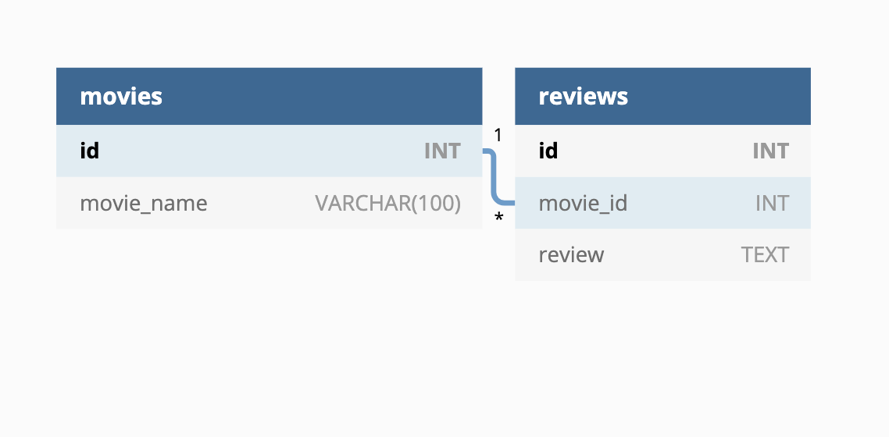

# Unit 12 Mini-Project: Movie Database

In this mini-project, you will build Rest API routes for creating, retrieving, and deleting movies from a MySQL database.

## User Stories

* As a user, I want to create a new database.

* As a user, I want to store movie names and reviews in the database in two separate table.

* As a user, I want to see a list of all movies.

* As a user, I want to be able to create and delete a movie.

* As a user, I want to return a list of all the reviews and the associated movie name.

## Acceptance Criteria

* It's done when `movie_db` is created and contains a `movies` and `reviews` table.

* It's done when `movie_db` has been seeded with data.

* It's done when the `/api/movies` route renders a list of all movies.

* It's done when the `/api/add-movie` route successfully adds a movie when tested using Insomnia.

* It's done when the `/api/update-review` route successfully updates a movie when tested using Insomnia.

* It's done when the `/api/movie/:id` route deletes a route when tested using Insomnia.

---

## Assets

Design the following database schema that contains two tables:

---

## Notes

To test your routes you will use Insomnia. If you have not already downloaded it, you will need to visit the [Insomnia download page](https://insomnia.rest/download) and do so.

Refer to the documentation:

[Insomnia documentation on getting started](https://support.insomnia.rest/category/152-using-insomnia)

[Express.js documentation on routing](https://expressjs.com/en/guide/routing.html)

[MySQL documentation on joins](https://dev.mysql.com/doc/refman/8.0/en/join.html)

[npm documentation on MySQL2](https://www.npmjs.com/package/mysql2)

## 💡 Hints

How can you link your `movies` and `reviews` tables?

How can you execute a query in an Express.js server using the npm `MySQL2` package?

## 🏆 Bonus

If you have completed this activity, work through the following challenge with your partner to further your knowledge:

* How can you add a route to update a review?

Use [Google](www.google.com) or another search engine to research this.

---
© 2021 Trilogy Education Services, LLC, a 2U, Inc. brand. Confidential and Proprietary. All Rights Reserved.
